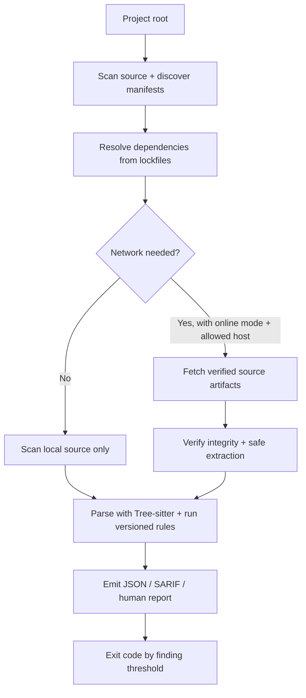

# chainsec

`chainsec` is a recursive static source scanner for Python, JavaScript, and TypeScript projects. It discovers dependency declarations, enriches them from supported lockfiles, safely acquires verified source artifacts, scans source with versioned Tree-sitter rules, and emits JSON, SARIF, or terminal reports.

Package source is parsed, never installed or executed. Acquisition and extraction are implemented in Rust; `chainsec` does not launch `python`, package managers, Git, shell commands, or archive executables.

> [!WARNING]
> **Pre-release software:** `chainsec` is not yet stable and may change incompatibly. It is developed with AI assistance; see the [AI Assistance Notice](AI_NOTICE.md).


## Table of contents

- [Features](#features)
- [What it scans for, and how](#what-it-scans-for-and-how)
- [How it works](#how-it-works)
- [Safe defaults](#safe-defaults)
- [Quick start](#quick-start)
- [Example output](#example-output)
- [Documentation](#documentation)

## Features

- **Recursive dependency scanning** — walks your project and its resolved Python, JavaScript, and TypeScript dependencies up to a configurable depth.
- **Lockfile-aware resolution** — enriches declarations from Poetry, Pipfile, uv, PDM, npm/Yarn/pnpm, and Deno lockfiles so dependencies are identified by exact version and integrity, not by name alone.
- **Tree-sitter precision** — parses source into concrete syntax trees and runs versioned queries, so `eval(...)` is matched as a call expression rather than the letters "eval" appearing anywhere in text.
- **Safe by default** — network is off unless you opt in, nothing is installed or executed, and acquisition/extraction are confined and bounded.
- **Multiple report formats** — a human-readable terminal report by default, plus JSON (schema-versioned) and SARIF for automation, with documented CI exit codes.
- **Extensible rules** — a versioned built-in catalog plus custom JSON/YAML rule packs and per-rule ignore selectors.

## What it scans for, and how

`chainsec` scans the source code of your project and its resolved dependencies (Python, JavaScript, and TypeScript) for malicious code and bad practices that could allow it to flourish. It never installs or executes package code; source is parsed statically.

What it can find, from the built-in versioned rule catalog:

- Dynamic execution (`eval`, indirect/computed `eval`, `Function`, string timers, Node VM APIs) and dynamic module loading
- Obfuscator structures including string tables, flattened dispatchers, RC4-like decoders, embedded bytecode VMs, and PyArmor markers
- Process execution and shell-out to external commands
- Decoded payloads (base64 and similar decode-then-use patterns) and high-entropy or opaque blobs that may hide payloads
- Network access (HTTP requests, sockets, DNS) embedded in dependency code
- Filesystem access, especially writes to sensitive or unexpected locations
- Environment variable and secret access (credential and token harvesting)
- Unsafe deserialization (`pickle`, `yaml.load`, `unserialize`-style sinks)
- Package installation hooks (`setup.py`, npm `preinstall`/`install`/`postinstall` entries), which are reported but never executed
- Syntax-aware equivalents of GuardDog source-code analyzers, plus custom JSON/YAML rule packs

How it works: Tree-sitter acts as a scalpel. Instead of blunt regex or substring matching over raw text, `chainsec` parses each source file into a concrete syntax tree and runs versioned Tree-sitter queries against it, surgically detecting malicious code and bad practices at the exact construct level — a call to `eval` is matched as a call expression, not as the letters "eval" appearing anywhere in text. This keeps detections precise (fewer false positives from comments, strings, or look-alike identifiers) and pinpoints exact source locations without executing code or following cross-file data flow. The configured query catalog is compiled once, and source files are analyzed through a bounded worker pool. Complementary bounded file-level heuristics identify compressed files, recognized native artifacts, unknown binary data, and high-entropy content; string-literal entropy analysis catches potential encoded payloads while excluding common structured values.

## How it works



`chainsec` never installs or executes package code. Acquisition and extraction are implemented in Rust; it does not launch `python`, package managers, Git, shell commands, or archive executables. See [`docs/SECURITY_MODEL.md`](docs/SECURITY_MODEL.md) for the precise trust model.

## Safe defaults

- Network access is off unless online mode is enabled with `--online` or `online = true` in configuration.
- Every outbound host must be allowed by the merged `allowed_hosts` configuration and `--allow-host` values. `--allow-host` adds hosts rather than replacing configured entries, so it cannot narrow a configured allowlist. A `chainsec remote` subcommand can additionally supply the selected package's metadata host, and a configured Artifactory metadata endpoint can supply its own host; redirects and artifact hosts are checked against the same policy.
- Dependencies must have a resolved version and integrity from a supported lockfile unless `--allow-unlocked` is supplied.
- Configured npm, PyPI, and JSR repositories must use HTTPS. A local `localhost`/loopback development registry may use HTTP only with the explicit `--allow-insecure-http`/`allow_insecure_http = true` opt-in, which is recorded in JSON report policy. Locked artifact URLs remain subject to the normal HTTP(S) and host policy.
- Supported registry and Deno artifact/module integrity values are checked before extraction or analysis. GitHub full-commit archives use the commit as their immutable identity; their downloaded SHA-256 is recorded for provenance but is not lockfile-supplied and cannot be independently checked against a declared artifact digest.
- Archive paths are confined beneath extraction roots; links, special files, and duplicate entries are rejected. Tar-family, ZIP/wheel, JSR, and local dependency snapshot paths share the configured path-component depth limit (128 by default).
- Downloads, extraction, source files, package count, graph depth, Deno graph size, redirects, requests, and per-package scan duration are bounded.
- Cache entries use resolved identities and pinned source URLs, retain valid publication winners, safely replace invalid entries under per-entry locks, and reconstruct scan-private source from integrity-bound retained artifacts on every hit.

For the precise trust model and remaining limitations, see [`docs/SECURITY_MODEL.md`](docs/SECURITY_MODEL.md). To report a vulnerability, see [`SECURITY.md`](SECURITY.md).

## Quick start

Local/offline scan:

```sh
chainsec scan --max-package-depth 0
```

Locked dependency scan with an explicit network policy:

```sh
chainsec scan /path/to/project \
  --online \
  --allow-host pypi.org \
  --allow-host files.pythonhosted.org \
  --allow-host registry.npmjs.org \
  --allow-host deno.land \
  --allow-host jsr.io \
  --allow-host codeload.github.com \
  --format sarif \
  --output report.sarif
```

Compare detections and capability evidence across remote package releases:

```sh
# The latest three pullable published releases, with adjacent diffs
chainsec remote diff npm:express --last 3

# Exactly these two published versions; intermediate releases are not scanned
chainsec remote diff npm:express --compare 0.1.1 0.5.4

# Every pullable published version in the inclusive interval, with adjacent diffs
chainsec remote diff npm:express --range 0.1.1 0.5.4
```

Exactly one of `--last`, `--compare`, or `--range` is required, and `--last`/the `--diff` convenience form require at least two releases so an oldest baseline exists. Remote version diffs support npm, PyPI, and JSR registry selectors and produce human output by default; use `--format json` for structured adjacent older → newer comparisons. SARIF represents a single scan and is not available for version diffs. `--max-packages` bounds both selected roots before download and the aggregate unique roots/dependency acquisitions retained by the batch. The convenience form `chainsec remote scan PACKAGE --diff N` is equivalent to `remote diff PACKAGE --last N`.

Create a starter project configuration (and add the project cache to `.gitignore`):

```sh
chainsec init
```

Without a project `chainsec.toml`, ChainSec uses a centralized cache (`$XDG_CACHE_HOME/chainsec` or `$HOME/.cache/chainsec`) instead of creating `.chainsec-cache` in the current directory. Use `chainsec cache purge` to remove cached contents while retaining the cache directory and its internal lifecycle lock, or pass `--cache <dir>` to select one explicitly.

## Example output

A human report summarizes the findings that meet the failure threshold and lists unique capabilities and alerts. Use `--verbose` to include findings below `--fail-on`.

```text
chainsec 0.4.0 — 3 package(s), 42 source file(s), 81920 source byte(s), 2 finding(s), 2 capability type(s), 0 issue(s)
High python:chainsec.py.detection.dynamic-code-execution:ArbitraryCodeExecution [root] src/main.py:12:5 — eval(user_input)

Summary
───────
Capabilities (2)
  filesystem:read
  network:connect
Alerts (1)
  High       1  python:chainsec.py.detection.dynamic-code-execution:ArbitraryCodeExecution
```

JSON reports use schema version `1.2.0` and include stable finding IDs, provenance, structured issues, informational capability evidence, and configured suppression reasons. See [`docs/RULES_AND_REPORTS.md`](docs/RULES_AND_REPORTS.md) and the [report schema](docs/schema/report.schema.json).

## Documentation

- [Installation](docs/INSTALLATION.md)
- [Configuration and CLI reference](docs/CONFIGURATION.md)
- [Dependency resolution and acquisition](docs/RESOLUTION.md)
- [Rules, reports, and exit status](docs/RULES_AND_REPORTS.md)
- [Heuristics and capability reference](docs/HEURISTICS.md)
- [Security model](docs/SECURITY_MODEL.md)
- [Development and releases](docs/DEVELOPMENT.md)
- [Frequently asked questions](docs/FAQ.md)
- [Third-party notices](docs/THIRD_PARTY.md)
