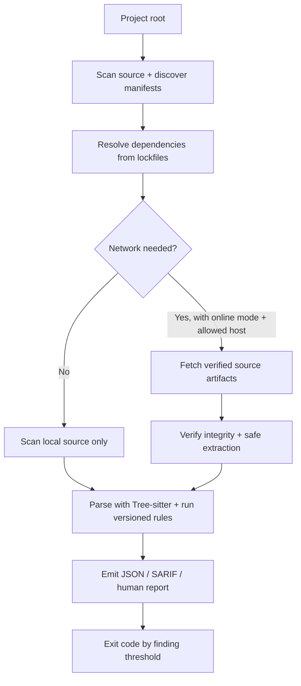

# chainsec

`chainsec` is a recursive static source scanner for Python, JavaScript, and TypeScript projects. It discovers dependency declarations, enriches them from supported lockfiles, safely acquires verified source artifacts, scans source with versioned Tree-sitter rules, and emits JSON, SARIF, or terminal reports.

Package source is parsed, never installed or executed. Acquisition and extraction are implemented in Rust; `chainsec` does not launch `python`, package managers, Git, shell commands, or archive executables.

See the [AI Assistance Notice](AI_NOTICE.md).


## Table of contents

- [Features](#features)
- [What it scans for, and how](#what-it-scans-for-and-how)
- [How it works](#how-it-works)
- [Safe defaults](#safe-defaults)
- [Quick start](#quick-start)
- [Example output](#example-output)
- [Documentation](#documentation)

## Features

- **Recursive dependency scanning** — walks your project and its resolved Python, JavaScript, and TypeScript dependencies up to a configurable depth.
- **Lockfile-aware resolution** — enriches declarations from Poetry, Pipfile, uv, PDM, npm/Yarn/pnpm, and Deno lockfiles so dependencies are identified by exact version and integrity, not by name alone.
- **Tree-sitter precision** — parses source into concrete syntax trees and runs versioned queries, so `eval(...)` is matched as a call expression rather than the letters "eval" appearing anywhere in text.
- **Safe by default** — network is off unless you opt in, nothing is installed or executed, and acquisition/extraction are confined and bounded.
- **Multiple report formats** — a human-readable terminal report by default, plus JSON (schema-versioned) and SARIF for automation, with documented CI exit codes.
- **Extensible rules** — a versioned built-in catalog plus custom JSON/YAML rule packs and per-rule ignore selectors.

## What it scans for, and how

`chainsec` scans the source code of your project and its resolved dependencies (Python, JavaScript, and TypeScript) for malicious code and bad practices that could allow it to flourish. It never installs or executes package code; source is parsed statically.

What it can find, from the built-in versioned rule catalog:

- Dynamic execution (`eval`, `exec`, `Function`-style constructs) and dynamic module loading
- Process execution and shell-out to external commands
- Decoded payloads (base64 and similar decode-then-use patterns) and high-entropy or opaque blobs that may hide payloads
- Network access (HTTP requests, sockets, DNS) embedded in dependency code
- Filesystem access, especially writes to sensitive or unexpected locations
- Environment variable and secret access (credential and token harvesting)
- Unsafe deserialization (`pickle`, `yaml.load`, `unserialize`-style sinks)
- Package installation hooks (`setup.py`, npm `preinstall`/`install`/`postinstall` entries), which are reported but never executed
- Syntax-aware equivalents of GuardDog source-code analyzers, plus custom JSON/YAML rule packs

How it works: Tree-sitter acts as a scalpel. Instead of blunt regex or substring matching over raw text, `chainsec` parses each source file into a concrete syntax tree and runs versioned Tree-sitter queries against it, surgically detecting malicious code and bad practices at the exact construct level — a call to `eval` is matched as a call expression, not as the letters "eval" appearing anywhere in text. This keeps detections precise (fewer false positives from comments, strings, or look-alike identifiers) and pinpoints exact source locations. Complementary bounded file-level heuristics (magic bytes, compression formats, entropy) flag opaque or binary files, and string-literal entropy analysis catches embedded secrets and encoded payloads.

## How it works



`chainsec` never installs or executes package code. Acquisition and extraction are implemented in Rust; it does not launch `python`, package managers, Git, shell commands, or archive executables. See [`docs/SECURITY_MODEL.md`](docs/SECURITY_MODEL.md) for the precise trust model.

## Safe defaults

- Network access is off unless online mode is enabled with `--online` or `online = true` in configuration.
- Every outbound host must be allowed by the merged `allowed_hosts` configuration and `--allow-host` values, unless a `--remote` selector or configured Artifactory metadata endpoint supplies its metadata host; redirects and artifact hosts are checked against the same policy.
- Dependencies must have a resolved version and integrity from a supported lockfile unless `--allow-unlocked` is supplied.
- HTTP and HTTPS are accepted for remote acquisition; other URL schemes are rejected. Prefer HTTPS because HTTP is plaintext.
- Supported registry and Deno artifact/module integrity values are checked before extraction or analysis. GitHub full-commit archives use the commit as their immutable identity; their downloaded SHA-256 is recorded for provenance but is not lockfile-supplied and cannot be independently checked against a declared artifact digest.
- Archive paths are confined beneath extraction roots; links, special files, and duplicate entries are rejected. Tar-family paths are limited to 128 components; ZIP/wheel paths are traversal-checked but do not have the same explicit component-depth limit.
- Downloads, extraction, source files, package count, graph depth, Deno graph size, redirects, requests, and per-package scan duration are bounded.
- Cache entries use resolved identities, are published atomically, and validate their package identity and extracted-tree digest on every hit.

For the precise trust model and remaining limitations, see [`docs/SECURITY_MODEL.md`](docs/SECURITY_MODEL.md). To report a vulnerability, see [`SECURITY.md`](SECURITY.md).

## Quick start

Local/offline scan:

```sh
chainsec --max-depth 0
```

Locked dependency scan with an explicit network policy:

```sh
chainsec /path/to/project \
  --online \
  --allow-host pypi.org \
  --allow-host files.pythonhosted.org \
  --allow-host registry.npmjs.org \
  --allow-host deno.land \
  --allow-host jsr.io \
  --allow-host codeload.github.com \
  --format sarif \
  --output report.sarif
```

Create a starter project configuration (and add the project cache to `.gitignore`):

```sh
chainsec --init
```

Without a project `chainsec.toml`, ChainSec uses a centralized cache (`$XDG_CACHE_HOME/chainsec` or `$HOME/.cache/chainsec`) instead of creating `.chainsec-cache` in the current directory. Use `chainsec --cache-purge` to remove the resolved cache, or pass `--cache <dir>` to select one explicitly.

## Example output

A human report lists each finding with its risk, rule, package, and exact source location:

```text
chainsec 0.2.0 — 3 package(s), 2 finding(s), 0 issue(s)
High execution:PY001 [root] src/main.py:12:5 — eval(user_input)
Medium network:PY004 [root] src/client.py:34:9 — requests.get(url)
```

JSON reports use schema version `1.0.0` and include stable finding IDs, provenance, and structured issues. See [`docs/RULES_AND_REPORTS.md`](docs/RULES_AND_REPORTS.md) and the [report schema](docs/schema/report.schema.json).

## Documentation

- [Installation](docs/INSTALLATION.md)
- [Configuration and CLI reference](docs/CONFIGURATION.md)
- [Dependency resolution and acquisition](docs/RESOLUTION.md)
- [Rules, reports, and exit status](docs/RULES_AND_REPORTS.md)
- [Security model](docs/SECURITY_MODEL.md)
- [Development and releases](docs/DEVELOPMENT.md)
- [Frequently asked questions](docs/FAQ.md)
- [Third-party notices](docs/THIRD_PARTY.md)
